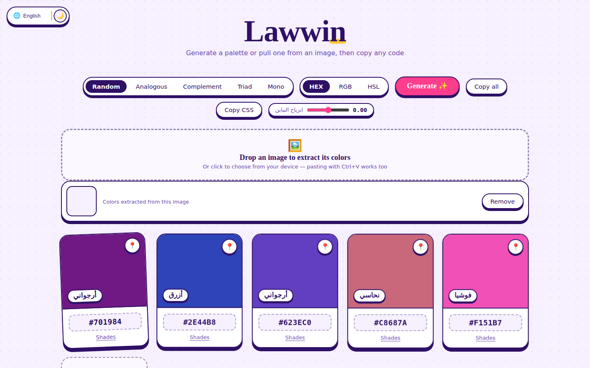

# لَوِّن (Lawwin)

مولّد ألوان ولوحات عربي — صفحة واحدة، بلا اعتماديات خارجية سوى الخطوط.
A single-file Arabic-first color palette generator, dependency-free aside from web fonts.

🔗 **Live demo:** أضف الرابط هنا بعد النشر / add your deployed URL here



## المزايا / Features

- **٥ أنماط تناغم**: عشوائي، متقارب، متمّم، ثلاثي، أحادي
  5 harmony modes: random, analogous, complementary, triad, monochrome
- **استخراج الألوان من صورة** بالسحب والإفلات أو اللصق (Ctrl+V)، عبر تجميع k-means في فضاء OKLab الإدراكي
  Extract a palette from any image via drag-and-drop or paste, using perceptual OKLab k-means clustering
- **قفل الألوان** 📌 أثناء التوليد، حذف وإضافة (٣–٧ ألوان)
  Lock colors while regenerating, add/remove swatches (3–7)
- **درجات لكل لون** مع **انزياح تباين** قابل للضبط
  Five tint/shade steps per color with an adjustable contrast-shift curve
- **نسخ فوري**: HEX / RGB / HSL، نسخ الكل، تصدير CSS variables
  One-click copy in HEX / RGB / HSL, copy-all, and CSS custom-properties export
- **وضع داكن/فاتح** يتكيّف معه توليد الألوان نفسه (لا الواجهة فقط)
  Dark/light mode that also reshapes the generation curve itself, not just the UI skin
- **١٢ لغة** مع اكتشاف تلقائي من لغة المتصفح واتجاه RTL/LTR كامل
  12 languages with automatic browser-language detection and full RTL/LTR switching
- **مشاركة اللوحة عبر الرابط** (hash-based)
  Palette sharing via URL hash

## التشغيل محليًا / Run locally

لا حاجة لأي بناء أو تثبيت — افتح الملف مباشرة:
No build step required — just open the file:

```bash
open index.html   # macOS
# or
xdg-open index.html   # Linux
# or double-click it on Windows
```

## النشر / Deploy

أي استضافة ملفات ثابتة تكفي. الأسرع:
Any static host works. Fastest options:

- **Netlify Drop**: اسحب `index.html` إلى [app.netlify.com/drop](https://app.netlify.com/drop)
- **GitHub Pages**: فعّل Pages من إعدادات المستودع على الفرع `main`، مجلد `/root`
  Enable Pages in repo settings → branch `main` → folder `/root`
- **Vercel / Cloudflare Pages**: اربط المستودع مباشرة، بلا أوامر بناء
  Connect the repo directly — no build command needed

## البنية التقنية / Tech notes

- HTML + CSS + Vanilla JS في ملف واحد (`index.html`)، بلا إطار عمل
  Single-file HTML/CSS/vanilla JS, no framework
- استخراج الألوان: تحويل sRGB→OKLab، ثم k-means بأولوية k-means++ الحتمية
  Color extraction: sRGB→OKLab conversion, then deterministic k-means++ seeded clustering
- الخطوط: Google Fonts (Baloo Bhaijaan 2 / Tajawal / Space Mono) — يتطلب اتصال إنترنت لتحميلها
  Fonts loaded from Google Fonts — requires internet access to fetch them

## الرخصة / License

استخدم الكود كما تشاء لمشاريعك الشخصية أو التجارية.
Use it freely for personal or commercial projects.
